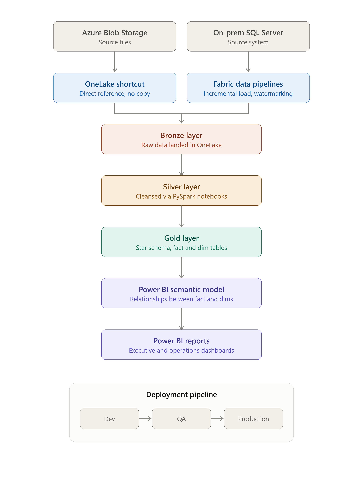
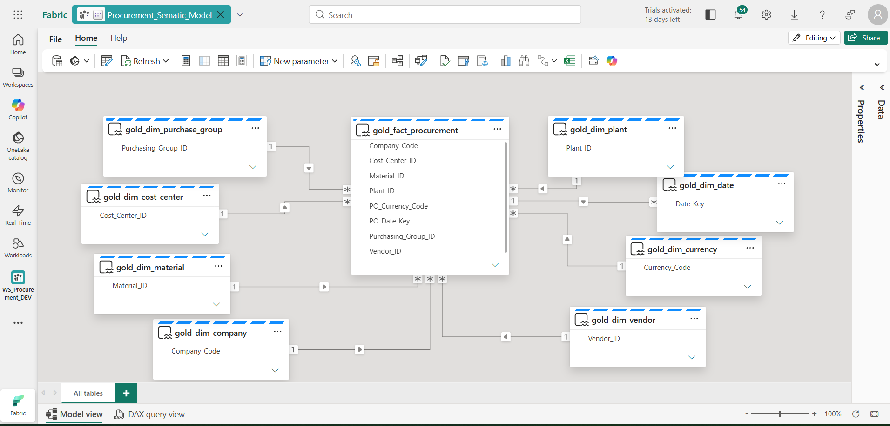
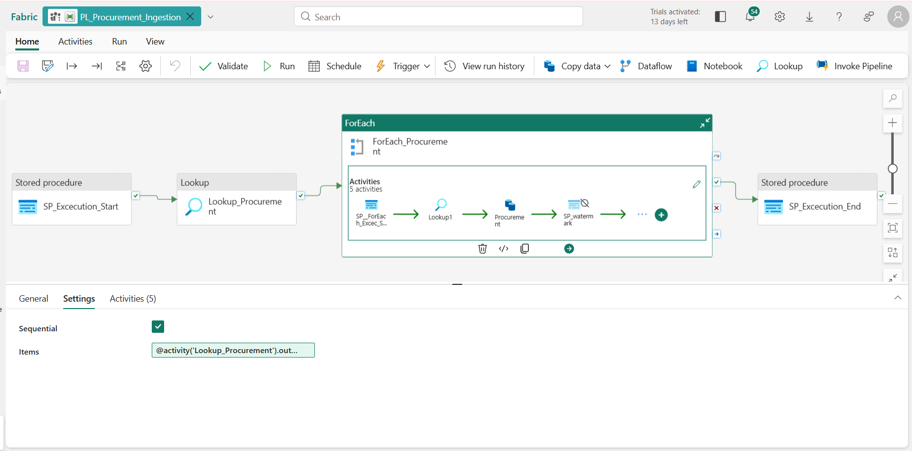
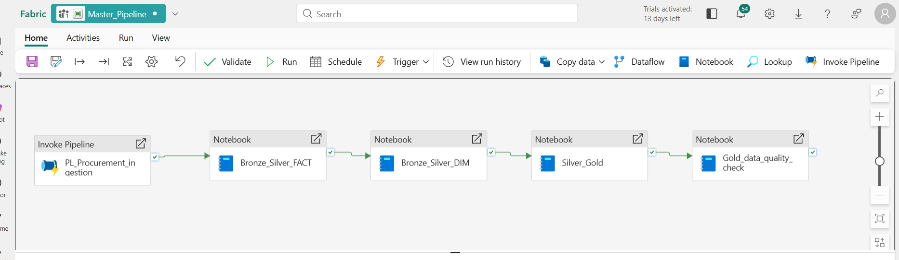
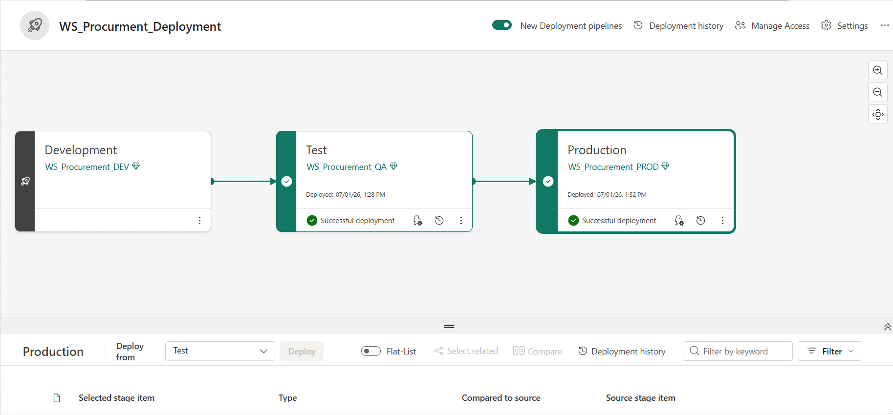
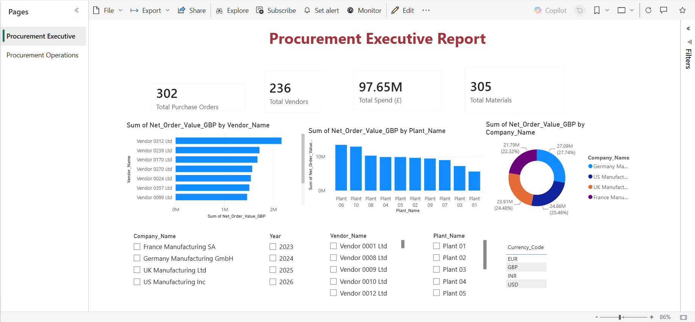
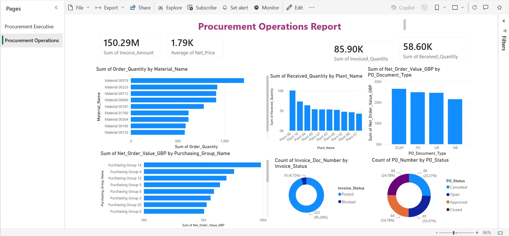
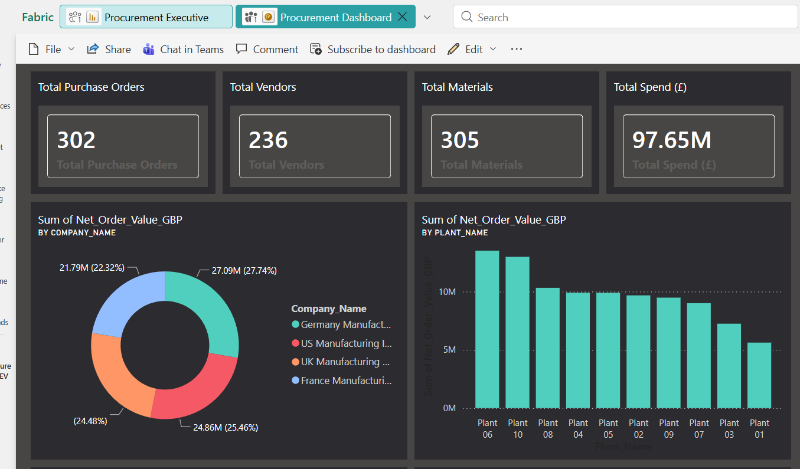
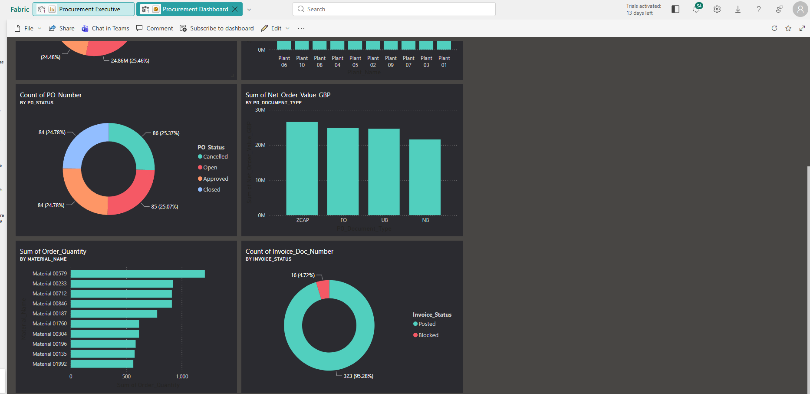

# Microsoft-Fabric-Procurement-Project

End-to-end Data Engineering & Analytics solution built in Microsoft Fabric. Features Data Factory ingestion pipelines, a multi-tier Medallion Architecture (Bronze/Silver/Gold) via PySpark notebooks, Delta Lake, star-schema data modeling, and automated executive Power BI reporting.

## Architecture

Medallion architecture (Bronze → Silver → Gold) built entirely in Microsoft Fabric, fed by two source systems using two different ingestion patterns:

- **Azure Blob Storage** (CSV and JSON source files) — connected via a **OneLake shortcut**, referencing the data directly without copying it into the lakehouse.
- **On-prem SQL Server** — loaded via **Fabric Data Pipelines**, using incremental loads with watermarking to only pull new/changed records on each run.

Both land in the **Bronze** layer, then flow through:

- **Bronze**: Raw ingestion from both source systems
- **Silver**: Cleansed, standardized dimension and fact tables (PySpark notebooks)
- **Gold**: Star-schema data model, ready for reporting
- **Semantic model**: Relationships defined between fact and dimensions for Power BI

## Tech Stack

- Microsoft Fabric (OneLake, Lakehouse, Data Pipelines)
- PySpark Notebooks
- Delta Lake
- Fabric SQL Database
- Azure Blob Storage
- Power BI

## Sample Data

The `/sample_data` folder contains synthetic dimension and fact data structured to match the Bronze layer inputs, so the notebooks in this repo are runnable end-to-end. See `sample_data/data_dictionary.md` for full column definitions.

> Note: all vendor names, values, and identifiers are synthetically generated for demonstration purposes and do not represent any real organization's data.

## Star Schema & Semantic Model

**Fact table:** `gold_fact_procurement`

**Dimension tables:** `gold_dim_vendor`, `gold_dim_material`, `gold_dim_plant`, `gold_dim_company`, `gold_dim_cost_center`, `gold_dim_currency`, `gold_dim_purchase_group`, `gold_dim_date`

One-to-many relationships are defined between the fact table and each dimension on its natural key (Vendor_ID, Material_ID, Plant_ID, Cost_Center_ID, Currency_Code, Purchasing_Group_ID, Date_Key), enabling correct cross-filtering across all report visuals without manual DAX joins.

## Pipeline Overview

- Two distinct ingestion patterns: OneLake shortcut (Blob) and Data Pipelines (SQL Server)
- Incremental loading with watermarking for the SQL source
- Incremental loading is driven by a dedicated `Watermark_Procurement` table (tracking `Last_Modified_Date` per source table), with full run auditing in `Pipeline_Execution_History`. See [`SQL/orchestration_tables.sql`](SQL/orchestration_tables.sql) for the table definitions and load mechanism.
- `ForEach`-based dynamic ingestion across source tables
- Automated stored procedure execution for pipeline start/end logging
- Data quality validation notebook checking for duplicate records, referential integrity, and dimension completeness at the Gold layer
- Three-environment deployment: Dev → QA → Production

Transformation logic for each Bronze source table is documented in [`Notebooks/mapping_specification.md`](Notebooks/mapping_specification.md), specifying source data types, business rules, and the PySpark casting/validation logic applied per column.

### Ingestion pipeline
Uses a `Lookup` activity to fetch the list of source tables, then a `ForEach` loop dynamically executes stored procedures per table, with watermark tracking for incremental loads.

### Master orchestration pipeline
Chains the ingestion pipeline with the Bronze→Silver→Gold notebooks in sequence.

## Deployment Pipeline

Three-stage deployment across isolated environments, promoting workspace items (notebooks, pipelines, semantic models, reports) from Development through to Production:

- **Development** — `WS_Procurement_DEV`
- **Test** — `WS_Procurement_QA`
- **Production** — `WS_Procurement_PROD`

Each stage is validated before promotion — deployments are tracked with timestamps and status, with the ability to compare stage items and review deployment history.

## Dashboards & Reports

### Executive Report

### Operations Report

### Executive Dashboard

### Operations Dashboard

## Repository Structure

- `/Notebooks` — PySpark notebooks (Bronze→Silver dimension/fact, Silver→Gold, Gold data quality checks) and the source-to-target mapping specification
- `/SQL` — Stored procedures and orchestration table definitions for pipeline processing and incremental loads
- `/Architecture` — Architecture diagrams
- `/Screenshots` — Dashboard, pipeline, and data model screenshots
- `/sample_data` — Synthetic sample source data (dimensions and facts) with a full data dictionary, so the notebooks can be run end-to-end

## What This Project Demonstrates

- End-to-end data pipeline design in a modern lakehouse platform
- Correct use of OneLake shortcuts vs. data pipelines depending on source type
- Deliberate source-to-target mapping design, including data type decisions, business rule enforcement, and cross-field validation, ahead of implementation
- Dimensional modeling (star schema) with properly defined semantic model relationships
- Data quality validation, including root-cause diagnosis of referential integrity issues (orphaned fact records against dimension keys)
- Incremental load patterns using watermarking
- CI/CD-style release management using Fabric Deployment Pipelines across Dev, QA, and Production workspaces
